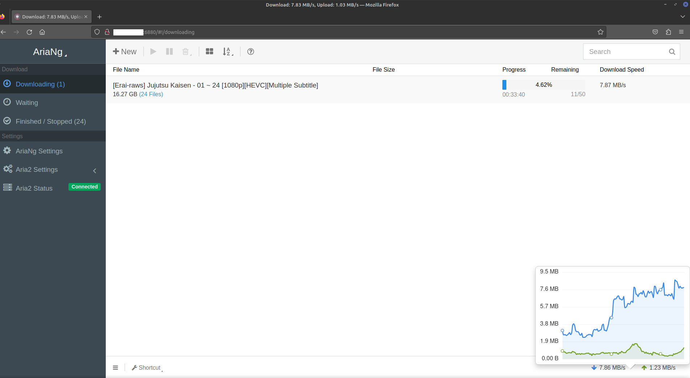
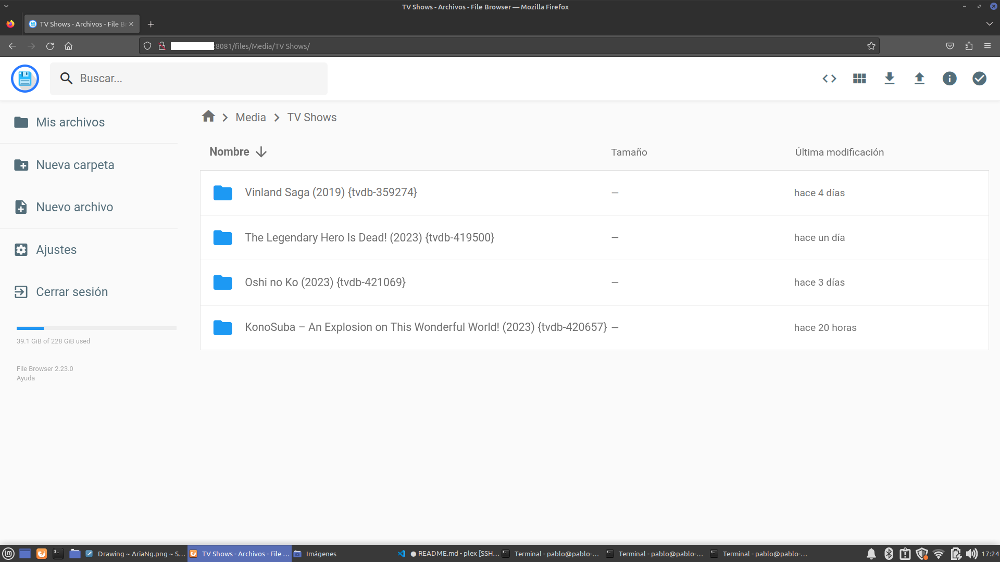
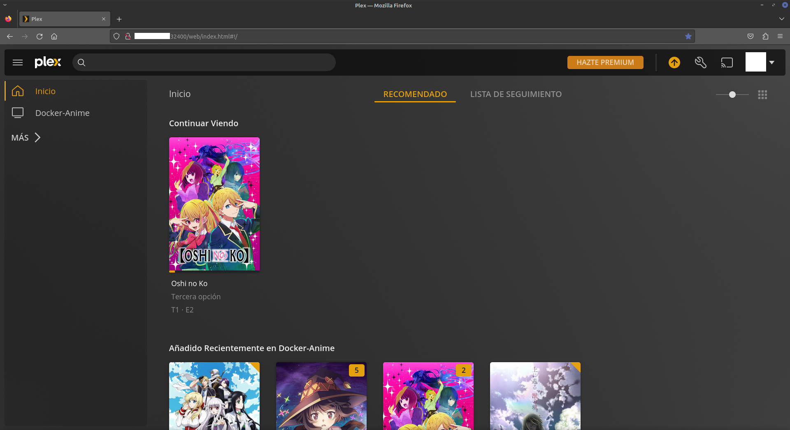

# AIO DockerPlex
Almost-out of the box Plex Media Server with a torrent UI client and an UI to manage your media files. As they are deployed as web services, they are fully  
### AriaNg's web UI

### File Browser

### Plex Media Server

# Index
1. [Acknowledgement](#ack)
2. [Too Long; Didn't Read](#tldr)

## Aknowledgments
### [Aria2c](https://aria2.github.io/)
Backend tool to download the torrent files. Transparent for the user.
### [AriaNg](https://github.com/mayswind/AriaNg)
Web UI to manage your torrent downloads. 
### [File Browser](https://filebrowser.org/)
Manage your downloaded files through a web interface. 
### [Jaymoulin's Plex Docker image](https://hub.docker.com/r/jaymoulin/plex/)
Deploy your Plex Media Server locally.  
Visit Jaymoulin's DockerHub page a [docker-compose](./docker-compose.yml) file to select any specific release. 
Follow the [official documentation]() for configuring your Plex Media Server.

## TLDR

1. Install [Docker](https://docs.docker.com/get-docker/) until you can execute their example.
2. Configure your RCP password in two places. They both need to be the same:
   1.  [docker-compose](./docker-compose.yml) -> *RPC_SECRET* in line 11.
   2.  [aria2.conf](./aria2-config/aria2.conf) -> *rpc-secret* in line 332.
3. Under the [filebrowser folder](./filebrowser/), create a file called `filebrowser.db`
4. Execute `docker compose up -d` to get everything started.
5. Visit `localhost:6880` to check your AriaNg web UI and manage your downloads.
   1. Visit settings>ariang and fill `Aria2 RPC Secret Token` with the RPC password that you choose in step 2.
   2. Reload the page clicking in the button.
6. Visit `localhost:8081`. The default user and password are `admin:admin`
7. Optional: I've included [cleaner-py](./cleaner.py) wich can be configured as a cron job or as a FileBrowser task.
Your local endpoints for each services have been deployed in the following ports:
- AriaNg: Deployed at localhost:6880
- File Browser: Deployed at localhost:8081
- Plex Media Server: Deployed at localhost:32400
 \
Disclaimer: All endpoints are available from your phone (and any machine in your local network), but you need to substitute `localhost` with the IP of the machine running the Docker containers.  
For example, if the IP of the machine running the containers is 1111.111.1.1 then you would need to go to 1111.111.1.1:6880 to access the AriaNg portal, and once there you would need to configure the AriaNg session with your RPC password from the new device.
